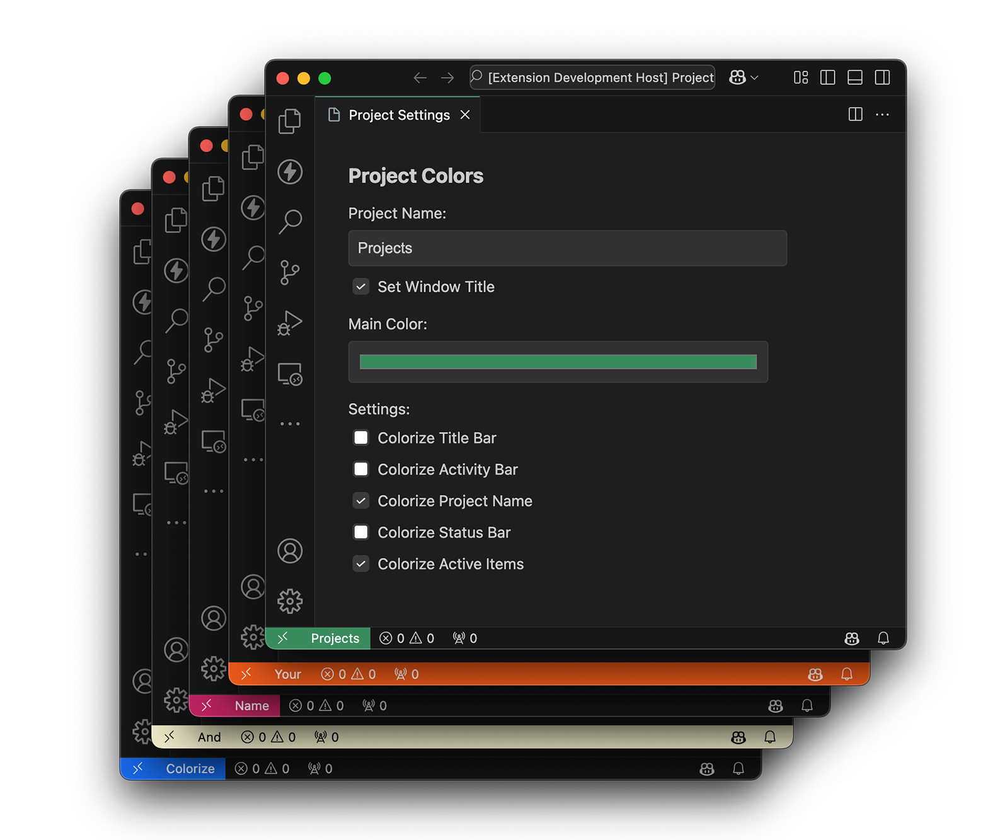
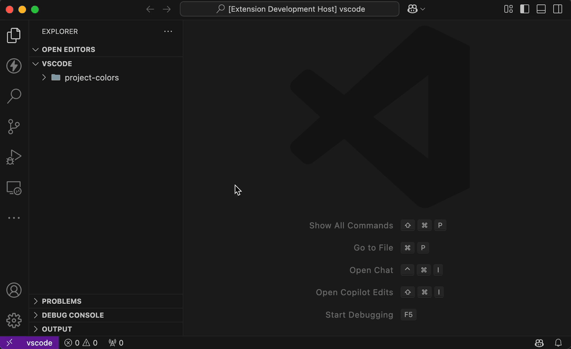
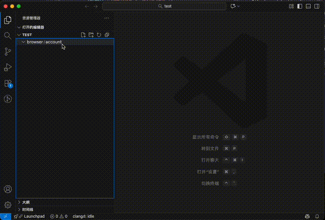
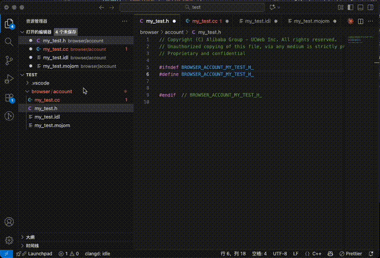

# Chromium Dev Kit


> **Development toolkit for Chromium projects** - Automate banner comments, header guards, and streamline C++/Mojom/IDL file creation.

---

## 📋 Overview

Chromium Dev Kit is a comprehensive VSCode extension designed for Chromium project developers. It combines powerful development automation with workspace customization:

### 🔧 Development Automation
- **Copyright banner comments** with customizable templates and variable substitution
- **Header guards** (`#ifndef`/`#define`/`#endif`) for C++ header files
- **Auto-include statements** for implementation files
- **Full support** for C++, Objective-C++, Mojom, and IDL files

### 🎨 Workspace Customization
- **Window color theming** to visually distinguish different projects
- **Custom window names** displayed in status bar
- **Real-time color preview** and adjustment
- **Per-workspace persistence** of color settings

Say goodbye to manually writing copyright headers and switching between similar-looking projects!

---

## ✨ Features

### Module 1: Chromium DevKit (Development Automation)

#### 🎯 Automatic Banner Generation
- **Auto-insert** copyright headers when creating new files
- **9 keyboard shortcuts** (`Cmd/Ctrl+Shift+1-9`) for quick template application
- **Template variables** for dynamic content: `{{Author}}`, `{{Mail}}`, `{{Company}}`, `{{Date}}`, `{{Year}}`

#### 🛡️ Header Guard Automation
- **Smart generation** of header guard macros from file paths
- **Configurable styles**: uppercase (`BROWSER_ACCOUNT_TEST_H_`) or lowercase
- **Automatic placement** after banner comments

#### 🔗 Auto-Include for Implementation Files
- **Intelligent matching**: `.cc` files automatically include corresponding `.h` files
- **Path calculation**: Uses workspace-relative paths for correct include statements

#### 📄 Broad File Type Support
- **Header files**: `.h` (banner + header guard)
- **Implementation files**: `.cc`, `.cpp`, `.mm` (banner + auto-include)
- **Interface files**: `.mojom`, `.idl` (banner only)

#### 🚫 Smart Duplicate Detection
- **Prevents re-insertion** of banners and header guards
- **Safe for existing files** - won't overwrite existing content

---

### Module 2: Window Color & Name (Workspace Customization)

#### 🎨 Visual Workspace Identification
- **Custom window colors** - Theme your VSCode window with any color
- **Window name display** - Show project name in status bar
- **Multiple color zones** - Customize status bar, title bar, and activity bar independently
- **Active items theming** - Apply colors to buttons, tabs, and UI elements


*Quickly identify and switch between different workspaces with custom colors.*

#### ⚙️ Flexible Configuration
- **Per-workspace settings** - Each project can have its own color scheme
- **Real-time preview** - See color changes immediately as you adjust
- **Settings UI panel** - User-friendly interface for color customization
- **Workspace persistence** - Colors automatically apply when opening projects


*Use the intuitive settings panel to customize your workspace appearance.*

#### 🎯 Color Zone Control
Choose which parts of VSCode to colorize:
- **Status Bar** - Bottom information bar (default: enabled)
- **Window Name Label** - Project name indicator (default: enabled)
- **Active Items** - Buttons, tabs, selections (default: enabled)
- **Title Bar** - Top window bar (default: disabled)
- **Activity Bar** - Left sidebar icons (default: disabled)

---

## 🎬 See It In Action

### Development Automation Demo

<!-- GIF placeholder: Banner and header guard generation -->

*Watch the extension automatically generate banners, header guards, and includes as you create files.*

### Workspace Customization Demo


*Easily distinguish between projects with custom colors and names.*

---

## 📦 Installation

### From VSCode Marketplace
1. Open VSCode
2. Press `Cmd+Shift+X` (Mac) or `Ctrl+Shift+X` (Windows/Linux)
3. Search for **"Chromium Dev Kit"**
4. Click **Install**

### Manual Installation
1. Download the `.vsix` file from [GitHub Releases](https://github.com/scott-leung/ChromiumDevKit-VSCode/releases)
2. Open VSCode
3. Press `Cmd+Shift+P` / `Ctrl+Shift+P`
4. Type: `Extensions: Install from VSIX...`
5. Select the downloaded `.vsix` file

---

## 🚀 Quick Start

### Step 1: Configure Your Information
1. Open VSCode Settings (`Cmd+,` or `Ctrl+,`)
2. Search for **"Chromium Dev Kit"**
3. Set your details:
   - **Author**: Your name
   - **Email**: Your email address
   - **Company**: Your organization name



*Configure your author information and watch it automatically populate in new files.*

### Step 2: Create a New File
Create a new C++ header file in your Chromium project:

```bash
touch browser/account/manager.h
```

**Result**: The extension automatically adds:

```cpp
//
// Copyright (C) Alibaba Group - UCWeb Inc. All rights reserved.
// Unauthorized copying of this file, via any medium is strictly prohibited
// Proprietary and confidential
// Author: WaitToModify
// Mail: WaitToModify@alibaba-inc.com
// Date: 2025/11/01
//

#ifndef BROWSER_ACCOUNT_MANAGER_H_
#define BROWSER_ACCOUNT_MANAGER_H_

// Your code here

#endif  // BROWSER_ACCOUNT_MANAGER_H_
```

### Step 3: Create Implementation File
Create the corresponding implementation file:

```bash
touch browser/account/manager.cc
```

**Result**: Auto-includes the header:

```cpp
//
// Copyright (C) Alibaba Group - UCWeb Inc. All rights reserved.
// Unauthorized copying of this file, via any medium is strictly prohibited
// Proprietary and confidential
// Author: WaitToModify
// Mail: WaitToModify@alibaba-inc.com
// Date: 2025/11/01
//

#include "browser/account/manager.h"

// Your implementation here
```

---

## 📖 Detailed Tutorial

### Tutorial 1: Creating Header Files

#### Scenario
You're working on a Chromium project and need to create a new header file for account management.

#### Steps
1. **Create file**: `browser/account/account_manager.h`
2. **Automatic result**:
   ```cpp
   // [Banner comment with your configured details]

   #ifndef BROWSER_ACCOUNT_ACCOUNT_MANAGER_H_
   #define BROWSER_ACCOUNT_ACCOUNT_MANAGER_H_

   // Your declarations here

   #endif  // BROWSER_ACCOUNT_ACCOUNT_MANAGER_H_
   ```

#### How It Works
- Extension detects `.h` file creation
- Applies default template (banner comment)
- Generates header guard from file path: `browser/account/account_manager.h` → `BROWSER_ACCOUNT_ACCOUNT_MANAGER_H_`
- Inserts closing `#endif` with comment

---

### Tutorial 2: Creating Implementation Files

#### Scenario
After creating a header, you need the corresponding implementation file.

#### Steps
1. **Create file**: `browser/account/account_manager.cc`
2. **Automatic result**:
   ```cpp
   // [Banner comment]

   #include "browser/account/account_manager.h"

   // Implementation code here
   ```

#### How It Works
- Extension detects `.cc` file creation
- Applies banner comment
- Calculates header path: `account_manager.cc` → `account_manager.h`
- Inserts `#include` with workspace-relative path

#### Supported Extensions
- `.cc` (C++)
- `.cpp` (C++)
- `.mm` (Objective-C++)

---

### Tutorial 3: Working with Mojom Files

#### Scenario
Creating interface definitions for Chromium IPC.

#### Steps
1. **Create file**: `browser/account/account_service.mojom`
2. **Automatic result**:
   ```cpp
   // [Banner comment]

   module account.mojom;

   // Your interface definitions
   ```

#### Notes
- Mojom files get banner comments only (no header guards)
- Same applies to `.idl` files

---

### Tutorial 4: Manual Template Application

#### Scenario
You have an existing file and want to add a different banner template.

#### Steps
1. **Open** existing C++ file
2. **Place cursor** at the top of the file
3. **Press keyboard shortcut**:
   - `Cmd+Shift+1` (Mac) or `Ctrl+Shift+1` (Windows/Linux) for Template 1
   - `Cmd+Shift+2` for Template 2
   - ... up to `Cmd+Shift+9` for Template 9

#### Result
The selected template is inserted at the cursor position with all variables replaced.

---

### Tutorial 5: Creating Custom Templates

#### Scenario
Your team uses MIT license instead of proprietary headers.

#### Steps

1. **Open Settings**: `Cmd+,` or `Ctrl+,`
2. **Search**: "Chromium Dev Kit"
3. **Edit** `chromiumDevKit.templates` in `settings.json`:

```json
{
  "chromiumDevKit.templates": [
    {
      "id": "mit",
      "name": "MIT License",
      "content": "// MIT License\n//\n// Copyright (c) {{Year}} {{Author}}\n// Email: {{Mail}}\n//\n// Permission is hereby granted, free of charge...\n\n"
    },
    {
      "id": "apache",
      "name": "Apache License 2.0",
      "content": "// Copyright {{Year}} {{Author}}\n//\n// Licensed under the Apache License, Version 2.0...\n\n"
    }
  ],
  "chromiumDevKit.defaultTemplateId": "mit"
}
```

4. **Set default**: Update `chromiumDevKit.defaultTemplateId` to your preferred template ID

#### Available Variables
| Variable | Replaced With | Example |
|----------|---------------|---------|
| `{{Author}}` | Your configured author name | `John Doe` |
| `{{Mail}}` | Your configured email | `john@example.com` |
| `{{Company}}` | Your configured company | `Acme Corp` |
| `{{Date}}` | Current date (formatted) | `2025/11/01` |
| `{{Year}}` | Current year | `2025` |

---

## ⚙️ Configuration

### Core Settings

#### Author Information
```json
{
  "chromiumDevKit.author": "Your Name",
  "chromiumDevKit.email": "your.email@company.com",
  "chromiumDevKit.company": "Your Company Name"
}
```

#### Template Management
```json
{
  "chromiumDevKit.templates": [
    {
      "id": "default",
      "name": "Default Template",
      "content": "// Copyright (C) {{Company}}. All rights reserved.\n\n"
    }
  ],
  "chromiumDevKit.defaultTemplateId": "default"
}
```

#### Automatic Behavior
```json
{
  "chromiumDevKit.autoAddOnCreate": true,        // Auto-add banner on file creation
  "chromiumDevKit.enableHeaderGuards": true,     // Generate header guards for .h files
  "chromiumDevKit.enableAutoInclude": true       // Auto-include in .cc/.cpp/.mm files
}
```

#### Header Guard Style
```json
{
  "chromiumDevKit.headerGuardStyle": "uppercase"  // or "lowercase"
}
```

**Examples**:
- `uppercase`: `BROWSER_ACCOUNT_MANAGER_H_`
- `lowercase`: `browser_account_manager_h_`

#### Date Format
```json
{
  "chromiumDevKit.dateFormat": "YYYY/MM/DD"  // or "YYYY-MM-DD" or "MM/DD/YYYY"
}
```

**Examples**:
- `YYYY/MM/DD`: `2025/11/01`
- `YYYY-MM-DD`: `2025-11-01`
- `MM/DD/YYYY`: `11/01/2025`

---

## ⌨️ Keyboard Shortcuts

| Shortcut (Mac) | Shortcut (Windows/Linux) | Action |
|----------------|--------------------------|--------|
| `Cmd+Shift+1` | `Ctrl+Shift+1` | Apply Template 1 |
| `Cmd+Shift+2` | `Ctrl+Shift+2` | Apply Template 2 |
| `Cmd+Shift+3` | `Ctrl+Shift+3` | Apply Template 3 |
| `Cmd+Shift+4` | `Ctrl+Shift+4` | Apply Template 4 |
| `Cmd+Shift+5` | `Ctrl+Shift+5` | Apply Template 5 |
| `Cmd+Shift+6` | `Ctrl+Shift+6` | Apply Template 6 |
| `Cmd+Shift+7` | `Ctrl+Shift+7` | Apply Template 7 |
| `Cmd+Shift+8` | `Ctrl+Shift+8` | Apply Template 8 |
| `Cmd+Shift+9` | `Ctrl+Shift+9` | Apply Template 9 |

> **Note**: Shortcuts only work when editing C++, Mojom, or IDL files.

---

## 💡 Examples

### Example 1: Team-Wide License Headers

**Goal**: Enforce consistent Apache 2.0 headers across your team.

**Solution**:
1. Create shared workspace settings (`.vscode/settings.json`):

```json
{
  "chromiumDevKit.author": "Your Team",
  "chromiumDevKit.company": "Your Organization",
  "chromiumDevKit.templates": [
    {
      "id": "apache",
      "name": "Apache 2.0",
      "content": "// Copyright {{Year}} {{Company}}\n//\n// Licensed under the Apache License, Version 2.0\n// http://www.apache.org/licenses/LICENSE-2.0\n\n"
    }
  ],
  "chromiumDevKit.defaultTemplateId": "apache"
}
```

2. Commit `.vscode/settings.json` to your repository
3. All team members get consistent headers automatically

### Example 2: Multiple Projects with Different Styles

**Goal**: Switch between open-source (MIT) and proprietary projects.

**Solution**: Use workspace-specific settings.

**Workspace 1** (Open Source - `.vscode/settings.json`):
```json
{
  "chromiumDevKit.defaultTemplateId": "mit"
}
```

**Workspace 2** (Proprietary - `.vscode/settings.json`):
```json
{
  "chromiumDevKit.defaultTemplateId": "proprietary"
}
```

### Example 3: Existing Files Without Headers

**Goal**: Add headers to legacy code.

**Solution**:
1. Open existing file (e.g., `legacy_code.cc`)
2. Place cursor at line 1
3. Press `Cmd+Shift+1` (or your preferred template shortcut)
4. Banner is inserted at the top

---

## 🔧 Troubleshooting

### Issue: Templates Not Applying

**Symptoms**: Keyboard shortcuts do nothing when pressed.

**Solutions**:
1. **Check file type**: Shortcuts only work for C++/Mojom/IDL files
2. **Verify focus**: Editor must have focus (click into the editor first)
3. **Check language mode**: VSCode should detect language as C++
   - Bottom-right corner should show "C++" or "Objective-C++"
   - For `.mojom`/`.idl`: manually set language mode if needed

### Issue: Header Guards Not Generated

**Symptoms**: New `.h` files don't have `#ifndef`/`#define`/`#endif`.

**Solutions**:
1. Check setting: `chromiumDevKit.enableHeaderGuards` should be `true`
2. Verify workspace: File must be inside a VSCode workspace folder
3. Check detection: Smart detection prevents duplicates if content already exists

### Issue: Auto-Include Not Working

**Symptoms**: `.cc` files don't automatically include `.h` files.

**Solutions**:
1. Check setting: `chromiumDevKit.enableAutoInclude` should be `true`
2. Verify naming: `.h` file must exist with same base name
   - `manager.cc` requires `manager.h` in same or parent directory
3. Check file creation: Only works for newly created files, not existing ones

### Issue: Wrong Author/Email Information

**Symptoms**: Generated banners show default or incorrect information.

**Solutions**:
1. **Update settings**: Configure in VSCode settings
2. **Workspace vs User**: Check if workspace settings override user settings
3. **Restart**: Reload VSCode window after settings change (`Cmd+Shift+P` → "Reload Window")

### Issue: Variables Not Replaced

**Symptoms**: Template shows `{{Author}}` instead of actual name.

**Solutions**:
1. **Check syntax**: Variables must use exact casing: `{{Author}}`, `{{Mail}}`, `{{Company}}`, `{{Date}}`, `{{Year}}`
2. **Verify settings**: Ensure author/email/company are configured
3. **Template format**: Use `\n` for line breaks in JSON, not actual newlines

---

## 🤝 Contributing & Support

### Report Issues
Found a bug or have a feature request?
- **GitHub Issues**: [Create an issue](https://github.com/scott-leung/ChromiumDevKit-VSCode/issues)

### Source Code
- **Repository**: [ChromiumDevKit-VSCode](https://github.com/scott-leung/ChromiumDevKit-VSCode)

### Version History
See [CHANGELOG.md](https://github.com/scott-leung/ChromiumDevKit-VSCode/blob/main/CHANGELOG.md) for release notes.

---

## 📄 License

This extension is licensed under the MIT License. See the repository for full license text.

---

## 🙏 Acknowledgments

Built with love for the Chromium developer community. Special thanks to all contributors and users who provided feedback.

### Open Source Contributions

This extension integrates and builds upon excellent open source projects:

- **[vscode-window-color](https://github.com/lennardv2/vscode-window-color)** by [Lennard Fonteijn](https://github.com/lennardv2) - The Window Color & Name module is based on this project. We are grateful for the solid foundation it provided for workspace customization features.

---

**Enjoy faster, more consistent Chromium development!** 🚀

If this extension saves you time, consider:
- ⭐ Starring the [GitHub repository](https://github.com/scott-leung/ChromiumDevKit-VSCode)
- 📝 Writing a review on the VSCode Marketplace
- 🐛 Reporting bugs or suggesting features
